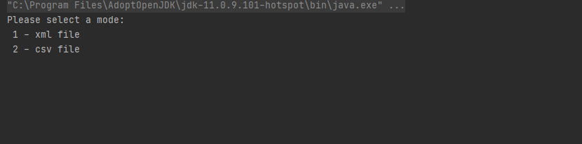

# JSONuploaderFile

The project involved creating a data uploader. There are two input files to choose from: CSV and XML. The location / name of the file is read from the configuration file. The configuration file is shown below:

After starting the program, enter the appropriate mode from the keyboard as in the photo below:

The input CSV file looks like this:

After converting to JSON:

The input XML file looks like this:

After converting to JSON:

